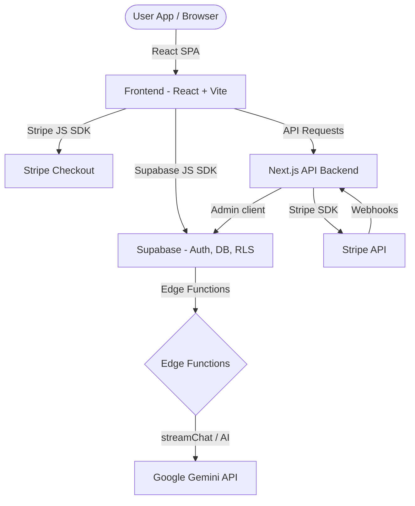

# 🏋️ SmartFit AI — Your Intelligent Fitness Companion

SmartFit AI is an intelligent, dual-model (B2C & B2B) fitness ecosystem that integrates computer vision, gesture recognition, and generative AI to deliver interactive coaching, form validation, gamified rewards, and comprehensive business optimization for gyms and personal trainers.

🌐 **Live Demo:** [www.smartfitai.in](https://www.smartfitai.in)  
💼 **LinkedIn:** [Eslavath Premkumar](https://www.linkedin.com/in/prem-kumar-eslavath-bb8013328/)  
🐙 **GitHub:** [@premkumar777-sys](https://github.com/premkumar777-sys)

---

## 📌 Project Overview

SmartFit AI aims to bridge the gap between traditional fitness routines and modern technological convenience:
* **For Individuals (B2C):** Provides cost-effective, real-time posture corrections using computer vision, generative AI fitness chat support, progress analytics, and custom workout generation.
* **For Gym Owners & Trainers (B2B):** Provides an enterprise workspace dashboard with member occupancy stats, QR security check-ins, trainer client workflows, and billing automation.

---

## ✨ Features

### B2C (Consumer Features)
* **🎥 AI-Powered Exercise Guidance:** Real-time pose analysis via MediaPipe for tracking form, counting repetitions, and generating feedback.
* **👋 Gesture Recognition:** Hands-free UI controls to navigate workout sessions without touching screen devices.
* **🤖 AI Personal Trainer Chat:** A 24/7 conversation partner that streams responses using Google Gemini API to guide users.
* **📊 Personalized Training & Nutrition:** Dynamic routines and diets based on BMI, age, weight, and goals.
* **🎮 Gamification System:** Level progressions, badges, streaks, and XP points.
* **📍 Gym Finder:** Locate nearby gym facilities.

### B2B (Gym & Enterprise Features)
* **📉 AI Business Analytics:** Tracking membership metrics, occupancy logs, and revenue.
* **💼 Trainer Tools:** A dedicated hub to assign routines, track clients, and coordinate training.
* **🔒 Contactless Security:** QR check-ins for active members.
* **💳 Billing Portals:** Custom invoices and subscription management.

---

## 🏗️ Tech Stack

* **Frontend:** React (v18), Vite, TypeScript, TailwindCSS, Framer Motion, Radix UI Primitives, Recharts, Zustand.
* **AI & Computer Vision:** TensorFlow.js, MediaPipe Tasks (Vision & Hand-tracking), Google Gemini API.
* **Backend:** Next.js API Routes (Subscription & Billing handling).
* **Database & Auth:** Supabase (Auth, RLS Policies, PostgreSQL database).
* **Payments:** Stripe Checkout & Webhook API integrations.

---

## 🏛️ System Architecture

SmartFit AI is structured around a decoupled, serverless client-server flow:



---

## 📂 Folder Structure

```
/
├── .github/                # GitHub configurations (CI, templates)
├── backend/                # Next.js API server (Stripe billing integration)
├── docs/                   # Documentation and playbook guides
├── public/                 # Static assets (MP4 exercises, images, favicons)
├── src/                    # Frontend React SPA codebase
│   ├── assets/             # Images and local products
│   ├── components/         # Reusable UI/logic elements
│   ├── config/             # Global payment and feature configs
│   ├── contexts/           # React Context providers (placeholder)
│   ├── hooks/              # Custom React hooks (auth, subscription, state)
│   ├── layouts/            # Page shell structures (placeholder)
│   ├── lib/                # Third-party wrappers (supabase client, streamChat)
│   ├── pages/              # Router screens and business modules
│   ├── routes/             # App routing definitions (placeholder)
│   ├── store/              # Global state managers (placeholder)
│   ├── styles/             # Modular CSS styling rules
│   ├── types/              # Global typescript declarations (placeholder)
│   └── utils/              # Helper utilities (placeholder)
├── supabase/               # SQL setups, migrations, and serverless config
├── tests/                  # Automated and manual verification suites
└── package.json            # Build scripts and dependency tracking
```

---

## 🚀 Getting Started

### Prerequisites
* **Node.js:** `v18.0.0` or higher
* **npm:** Standard package manager

### Installation

1. **Clone the repository:**
   ```bash
   git clone https://github.com/premkumar777-sys/smartfit-hub.git
   cd smartfit-hub
   ```
2. **Install frontend packages:**
   ```bash
   npm install
   ```
3. **Install backend packages:**
   ```bash
   cd backend
   npm install
   cd ..
   ```

### Environment Variables

#### 1. Frontend Environment File (`/.env`)
Create a `.env` file in the root workspace folder:
```env
VITE_SUPABASE_URL=https://your-project-id.supabase.co
VITE_SUPABASE_ANON_KEY=your-supabase-anonymous-key
VITE_API_URL=http://localhost:3000
```

#### 2. Backend Environment File (`/backend/.env.local`)
Create a `.env.local` inside the `/backend` folder:
```env
STRIPE_SECRET_KEY=sk_test_...
STRIPE_WEBHOOK_SECRET=whsec_...
NEXT_PUBLIC_SUPABASE_URL=https://your-project-id.supabase.co
SUPABASE_SERVICE_ROLE_KEY=your-supabase-service-role-key
NEXT_PUBLIC_SITE_URL=http://localhost:3000
```

### Development

To run both the frontend and backend servers concurrently, execute:
```bash
npm run dev:full
```
* **Frontend Site:** `http://localhost:8080` (Vite)
* **Backend Endpoint:** `http://localhost:3000` (Next.js)

### Deployment

* **Frontend:** Deployable to Vercel/Netlify using the default build command `npm run build` and output folder `dist`.
* **Backend:** Deployable to Vercel via Serverless API routes (from `/backend`).
* **Database & Auth:** Handled directly through the Supabase cloud instance.

---

## 🤝 Contributing

Contributions are welcome! Please check the [Contributing Guidelines](./CONTRIBUTING.md) and adhere to the [Code of Conduct](./CODE_OF_CONDUCT.md).

---

## 📄 License

This project is licensed under the MIT License - see the [LICENSE](./LICENSE) file for details.
