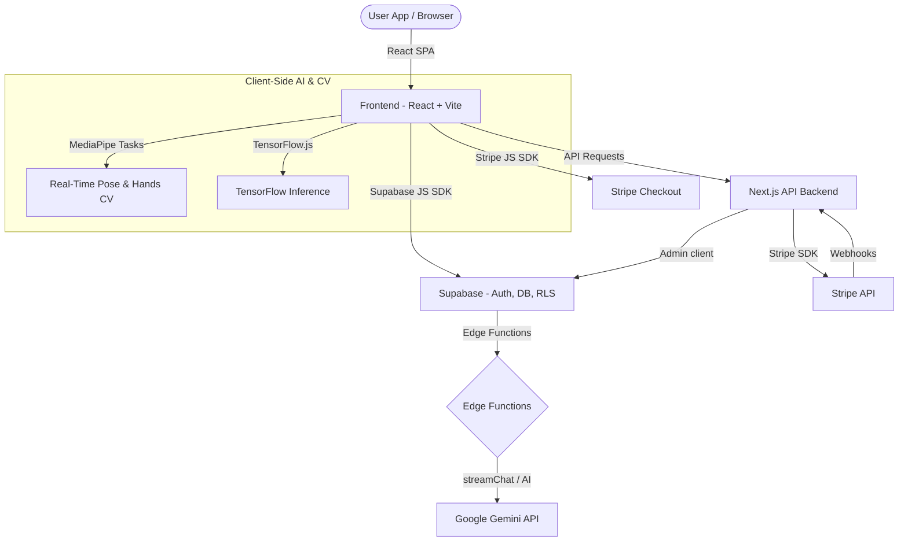
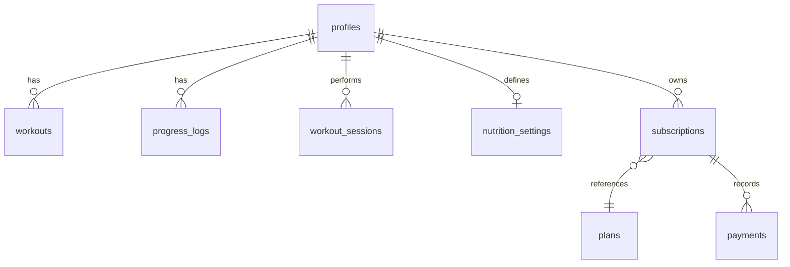

# 🚀 SmartFit AI — Startup & Developer Playbook

Welcome to **SmartFit AI**! This document serves as the ultimate developer playbook and onboarding guide. It details our startup vision, core B2C and B2B pillars, architectural design, database structures, local development workflows, and coding standards.

---

## 📌 Startup Vision & Value Proposition

SmartFit AI is an intelligent, dual-model (B2C & B2B) fitness ecosystem that integrates computer vision, gesture recognition, and generative AI to deliver interactive coaching and business optimization. 

### The Problem We Solve
* **For Individuals (B2C):** Traditional personal trainers are expensive, workouts lack form feedback, and beginners struggle to maintain consistency.
* **For Gym Owners & Trainers (B2B):** Facilities are digitally disconnected, administrative tasks are manual, client retention is low, and analytical insights are lacking.

### Our Solution
1. **Interactive AI Trainer:** Real-time gesture controls, computer-vision pose detection, and custom-generated workouts.
2. **Enterprise Gym Hub:** A B2B dashboard offering AI business analytics, Trainer platforms, member security check-ins via QR codes, and smart billing.

---

## 🏗️ System Architecture

SmartFit AI is built with a highly decoupled, modern tech stack designed for speed, scalability, and seamless user experience.



---

## 🌟 Product Pillars & Core Features

### 1. B2C (Consumer) Experience
* **AI Workout Generator (`/ai-workout`):** A custom workout plan engine utilizing the user's biology (age, weight, height, BMI) and goals. Supports a special *Body Recomposition* goal.
* **AI Personal Trainer Chat (`/ai-trainer`):** A 24/7 conversational companion that streams responses using Google Gemini API to guide users on form, training, and nutrition.
* **Computer Vision Workouts (`/workout-session` & `/3d-trainer`):** 
  * Real-time pose analysis using MediaPipe for form tracking.
  * Gesture navigation for hands-free workout progression.
  * A 3D Trainer mode for workouts without active camera permissions.
* **Gamification System (`/gamification`):** XP-based rewards, levels, workout streaks, and target badges to drive user experience.
* **Road to ICN (`/road-to-icn`):** A dedicated bodybuilding prep platform tailored to natural fitness competition prep.
* **Giveaway Center (`/giveaway`):** Viral challenges (e.g., the 40-pushups challenge) with direct video uploads to Supabase storage.

### 2. B2B (Enterprise & Gyms) Experience
* **AI Business Analytics (`/gym-analytics`):** Real-time analytics dashboards for gym operators tracking membership growth, revenue statistics, and live check-ins.
* **Trainer Tools (`/trainer-tools`):** Interactive workspaces for on-floor trainers to track client compliance, assign routines, and schedule coaching.
* **Facility Security (`/business/security`):** QR-based contactless entrance checking and active occupant logs.
* **Smart Billing (`/business/payments`):** Automated payment portals for commercial operators.

---

## 🛠️ Technical Stack Reference

| Layer | Technologies | Key Packages |
| :--- | :--- | :--- |
| **Frontend Framework** | React (v18), Vite, TypeScript | `react-router-dom`, `@tanstack/react-query`, `zustand` |
| **UI & Animation** | TailwindCSS, Radix UI Primitives, Framer Motion | `tailwindcss-animate`, `framer-motion`, `lucide-react` |
| **Analytics & Data Vis**| Recharts | `recharts` |
| **Computer Vision** | TensorFlow.js, MediaPipe Tasks | `@mediapipe/pose`, `@mediapipe/tasks-vision`, `@tensorflow/tfjs` |
| **Backend API Server** | Next.js (v16) API | `next`, `react`, `react-dom` |
| **Database & Auth** | Supabase | `@supabase/supabase-js` |
| **Payments** | Stripe | `@stripe/stripe-js`, `stripe` |

---

## 🗄️ Database Schema & Security (Supabase)

Our database is managed via Supabase and secured by PostgreSQL Row Level Security (RLS) policies.



### Key Database Tables

1. **`profiles`**: User metadata, fitness stats, and premium/admin access flags.
   * *RLS Policy:* Users can view, insert, and update only their own profile.
2. **`workouts`**: Custom generated routines.
   * *RLS Policy:* Users can perform CRUD operations only on their own workouts.
3. **`progress_logs`**: Weight and health metrics history.
4. **`subscriptions` & `payments`**: Holds Stripe active plan metadata and payment history.
5. **`giveaway_entries`**: Stores contest submissions, including names, Instagram handles, sizes, addresses, and challenge video URLs.
   * *RLS Policy:* Anonymous users can insert (public submission), but only backend service roles can read entries.

> [!NOTE]
> DB schemas and tables can be initialized or updated using the scripts in `supabase/schema.sql` and `supabase/giveaway_setup.sql`.

---

## 🔒 Subscription Control & Feature Gates

We support toggling payment logic and custom locks for premium features:

* **Global Payments Toggle (`src/config.ts`):** 
  ```typescript
  export const ENABLE_PAYMENTS = true; // Toggle to false to disable all paywalls (Beta Mode)
  export const ENABLE_B2B_FEATURES = true; // Toggle B2B modules on/off
  ```
* **Premium Feature Wrapper (`PremiumLock.tsx`):** Protects routes and tabs. Admin emails (e.g., `eslavathpremkumar17@gmail.com`) automatically bypass paywalls as a fail-safe.

---

## 🚀 Local Development Setup

Follow these steps to run the SmartFit AI hub locally.

### Prerequisites
* Node.js (v18 or higher)
* Supabase CLI (Optional) or a Supabase Cloud project

### Step 1: Clone and Install Dependencies
```bash
# Clone the repository
git clone https://github.com/premkumar777-sys/smartfit-hub.git
cd smartfit-hub

# Install Frontend dependencies
npm install

# Install Backend dependencies
cd backend
npm install
cd ..
```

### Step 2: Configure Environment Variables

1. **Frontend Environment:** Create a `.env` in the root folder.
```env
VITE_SUPABASE_URL=https://your-project-id.supabase.co
VITE_SUPABASE_ANON_KEY=your-supabase-anonymous-key
VITE_API_URL=http://localhost:3000
```

2. **Backend Environment:** Create a `.env.local` inside the `backend/` folder.
```env
STRIPE_SECRET_KEY=sk_test_your_secret_key
STRIPE_WEBHOOK_SECRET=whsec_your_webhook_secret
NEXT_PUBLIC_SUPABASE_URL=https://your-project-id.supabase.co
SUPABASE_SERVICE_ROLE_KEY=your-supabase-service-role-key
NEXT_PUBLIC_SITE_URL=http://localhost:3000
```

### Step 3: Run the Development Server
You can launch both the frontend and Next.js backend concurrently:
```bash
npm run dev:full
```
* **Frontend UI:** `http://localhost:8081` (Vite dev server)
* **Backend API:** `http://localhost:3000` (Next.js server)

---

## 🎨 UI & Design Philosophy

We enforce **high-fidelity dark mode aesthetics** with vibrant glassmorphic layers:
* **Typography:** Modern Sans-Serif fonts (Inter, Outfit).
* **Color Palette:** Sleek charcoal backgrounds, neon green accents (`#00FF9C`), and custom glowing gradients.
* **Responsive Layouts:** The workspace is touch-optimized for mobile using a glassmorphic floating bottom navigation bar (`BottomNavigation.tsx`) to ensure convenient thumb-reach access.

---

### 👨‍💻 Author & Startup Lead
**Eslavath Premkumar**
* GitHub: [github.com/premkumar777-sys](https://github.com/premkumar777-sys)
* LinkedIn: [Eslavath Premkumar](https://www.linkedin.com/in/prem-kumar-eslavath-bb8013328/)
