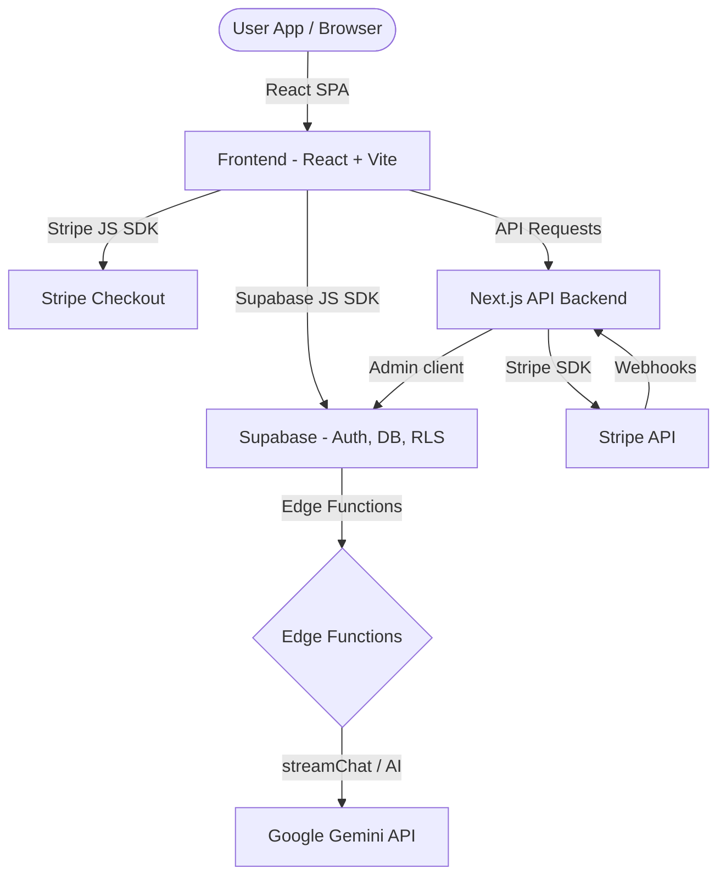

# 🏗️ Architecture Design

SmartFit AI is structured around a modern decoupled client-server architecture to provide a seamless, interactive user experience.

## Frontend Single Page Application (SPA)

The main frontend is built on **React (v18)** and **Vite (v8)**, using **TypeScript** for robust typing.

- **Vite & bundler optimizations**: Replaces expensive server-side logic by relying on clientside assets and fast static page routing.
- **State Management**: Uses **Zustand** for lightweight global and modular state (e.g. settings, subscriptions, gamification metrics).
- **Styling & UI**: Built with custom HSL variables and TailwindCSS with animations (via `framer-motion`) and predesigned Radix UI primitives.
- **Client-Side AI & Computer Vision (CV)**:
  - **MediaPipe Pose & Hand Detection**: Runs live inside the user's browser thread to analyze camera inputs for form checking and tracking reps.
  - **TensorFlow.js**: Provides inference for local deep learning models on the browser, supporting WebGL/WebGPU acceleration when available.

## Backend Services

The project uses a hybrid backend to optimize for different types of payloads.

### 1. Supabase (Database, Auth, Serverless Functions)
- **Database**: PostgreSQL database holding profiles, custom workouts, subscription billing history, and gamification logs.
- **Authentication**: JWT-based login, signup, and session controls.
- **Row Level Security (RLS)**: Enforces database policies directly at the SQL level.
- **Edge Functions**: Used for fast server-side logic (e.g., streaming chats with Gemini).

### 2. Next.js (Admin API Backend)
- **API routes**: Processes subscription webhooks and handles Stripe integrations safely.
- **Admin service client**: Interacts with Supabase using credentials bypass for backend validations.

